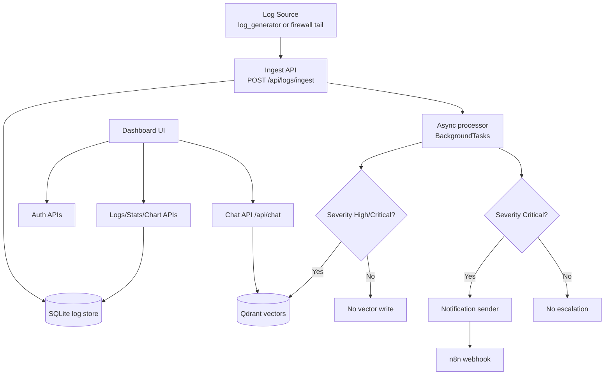
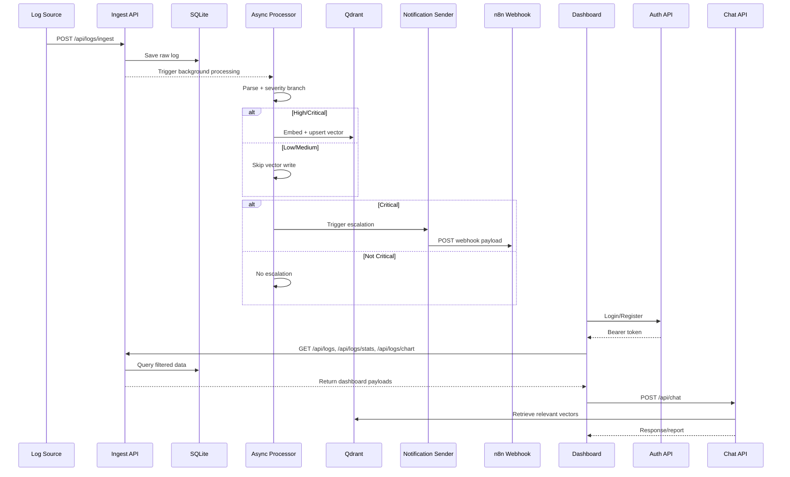
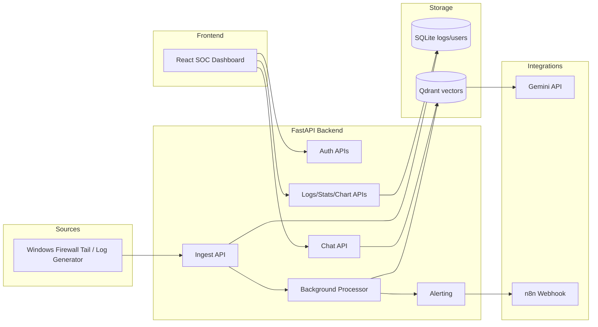

# brahmos-v1 — SOC Dashboard

FastAPI + SQLite ingest, React UI, Qdrant + Gemini for High/Critical summaries and chat, optional n8n webhooks on **Critical** logs.


## Setup

```bash
git clone <repo-url> brahmos-v1 && cd brahmos-v1
```

Create **`backend/.env`**:

```env
GEMINI_API_KEY=
SECURITY_ALERT_WEBHOOK_URL=
```

Deploy:

```bash
docker compose up -d --build
```

| Service | URL |
|---------|-----|
| Dashboard | http://localhost:5173 |
| API | http://localhost:8000/docs |
| n8n | http://localhost:5678 |

**n8n (optional):** Webhook (POST) → e.g. Gmail → paste Production URL into `SECURITY_ALERT_WEBHOOK_URL` → `docker compose up -d backend`. Payload shape: `backend/notifications.py`.

**Local dev:** `backend/` → `uvicorn main:app --reload` · `frontend/` → `npm install && npm run dev` (optional `VITE_API_BASE_URL`). Qdrant on `QDRANT_URL` if needed.


## Flow Diagram (Data Flow)



Uses real firewall log traffic. Set `SECURITY_ALERT_WEBHOOK_URL` for Critical webhooks. `GEMINI_API_KEY` enables embeddings and chat.

## Orchestration Diagram (Runtime Sequence)



## Architecture Diagram (System Components)


